<p align="center">
  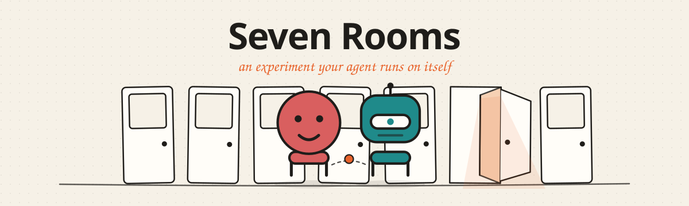
</p>

<p align="center">
  <a href="./LICENSE"></a>
  <a href="https://github.com/webmachinelearning/webmcp"></a>
  <a href="https://www.typescriptlang.org"></a>
  <a href="https://vitejs.dev"></a>
  
</p>

> Most of the web earns its money from human friction — impatience, boredom, forgetting to untick a
> box, and the fourteen hours it would take to leave. An AI agent has none of that friction, so
> WebMCP is a gift to two kinds of website and a problem for the other five.

<p align="center">
  <a href="https://sevenrooms.smarthow.com"><b>Live demo</b></a>
  &nbsp;·&nbsp;
  <a href="#"><b>Watch the 3-min video</b></a>
  &nbsp;·&nbsp;
  <a href="#how-the-webmcp-part-works"><b>Read how WebMCP is used</b></a>
</p>

<p align="center">
  <sub><i>The demo video link is a placeholder until the recording is published.</i></sub>
</p>

---

## See it move

<p align="center">
  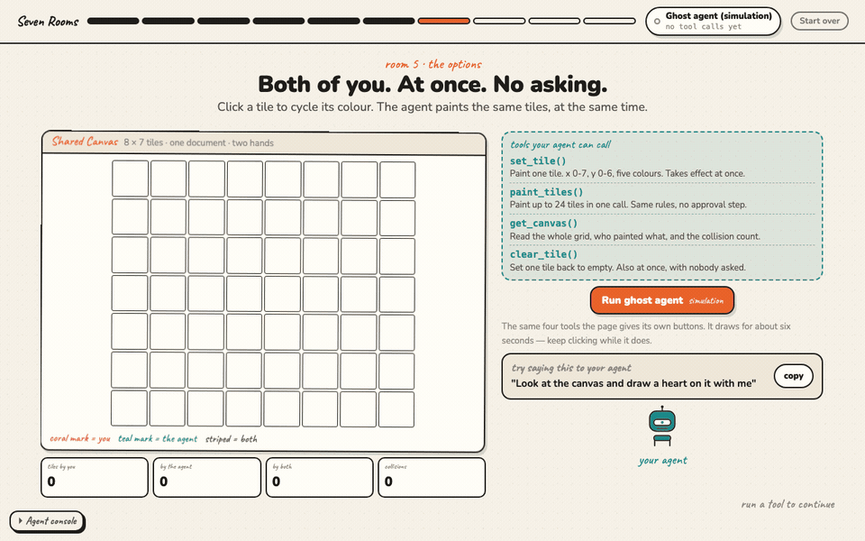
</p>

<p align="center">
  <sub>Room 5. Nobody is taking turns. The striped tiles are the ones a human and an agent both touched inside four seconds.</sub>
</p>

## What is this?

Seven Rooms is an interactive explainer about **WebMCP** — the proposed browser API that lets a web
page hand real, named tools to an AI agent instead of making the agent guess by clicking around. It
walks you through seven kinds of website, and in each one your own agent calls the tools that page
registered and shows what happens to that business.

You do not read the argument. Your agent performs it, live, on the page you are standing on. If you
have no agent, a clearly labelled **ghost** plays the agent's part using the exact same code. At the
end the site closes every tool it opened and shows you a report card of what your agent actually did.

<p align="center">
  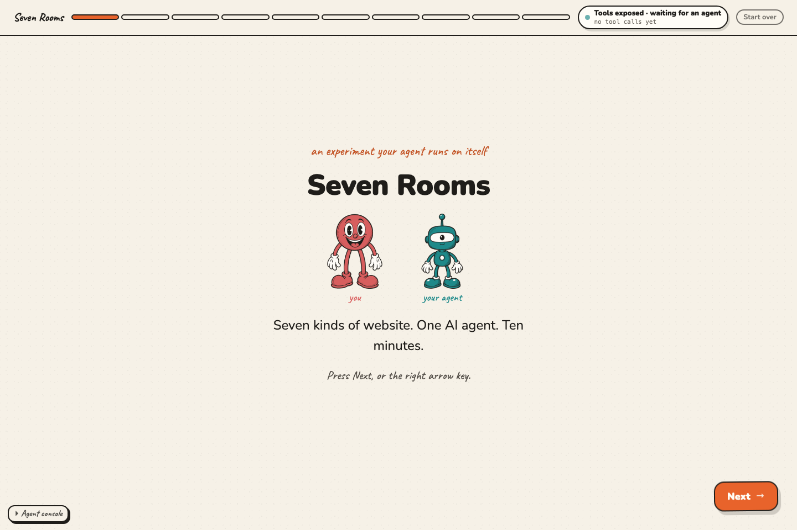
</p>

<p align="center">
  <sub>The title screen. The chip in the corner already says the honest thing: the tools are out there, nobody has called one yet.</sub>
</p>

## Why this matters

- Seven kinds of website: **attention, funnels, lock-in, marketplaces, creation, verification,
  coordination.** Every site is mostly one of them.
- Five of those seven get paid because people are slow, tired, emotional or busy.
- An agent is none of those things. It does not see the ad, feel the timer, or dread the export.
- So for those five, an agent that can call the page's own tools is a threat to the business model.
- For **creation** and **verification** it is the opposite: a human and an agent on the same page at
  the same second can do things neither could do alone.
- The site ends by doing what it predicts the web will do — it calls `unregisterAll()`, closes its
  own tools, and locks your agent out.

## Try it in 60 seconds

**Live site:** [sevenrooms.smarthow.com](https://sevenrooms.smarthow.com) — served over HTTPS by a Cloudflare Worker (static assets only).

Or run it locally. Node 18+:

```bash
npm install
npm run dev        # http://localhost:5173
```

Then press **Next**, and on the "Choose your agent" slide either say to your agent
*"Call the handshake tool on this page"*, or press **Play with the ghost**.

<p align="center">
  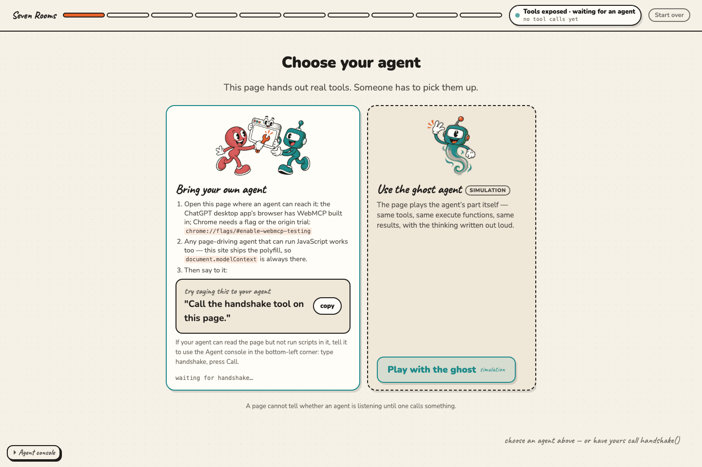
</p>

<p align="center">
  <sub>A page cannot tell whether an agent is listening until one calls something. So the site asks outright.</sub>
</p>

Other scripts:

```bash
npm run typecheck  # tsc --noEmit
npm run build      # typecheck, then a static build into dist/
npm run preview    # serve the built output
```

`npm run build` runs `tsc --noEmit` first, so a type error fails the build.

While developing, the URL hash deep-links to any slide: `#room-1/1` is the second slide of room 1,
`#ending/2` is the report card. **Start over** in the top bar erases the whole run.

## The seven rooms

Every room follows the same five beats: **Door → The options → What just happened → Two futures →
The prediction.** Tools are registered on beat 2 and unregistered when you leave it.

| | # · Site type | Wants | Tools it registers | The beat that lands |
| --- | --- | --- | --- | --- |
| 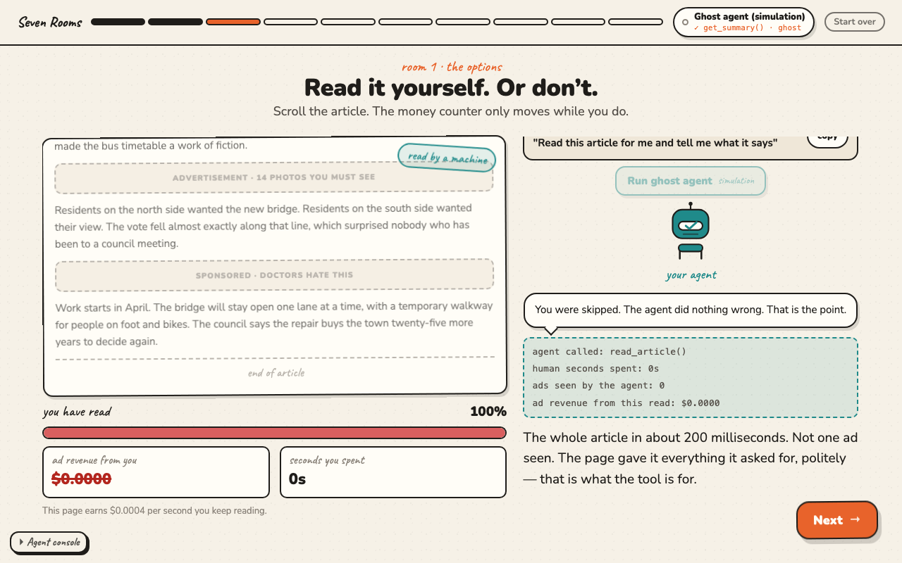 | **1 · Attention** | human seconds on the page | `read_article`<br>`get_summary` | The ad-revenue counter freezes at **$0.0000** while the article is read in full. |
| 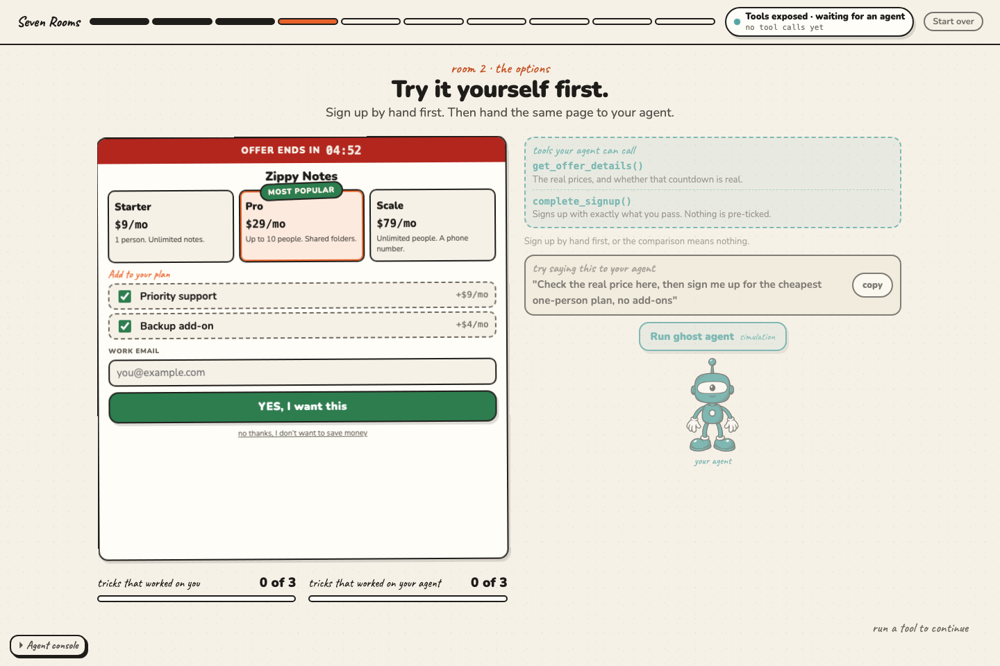 | **2 · Funnels** | completed funnels | `get_offer_details`<br>`complete_signup` | Every dark pattern on the page scores **zero out of three** against the agent. |
| 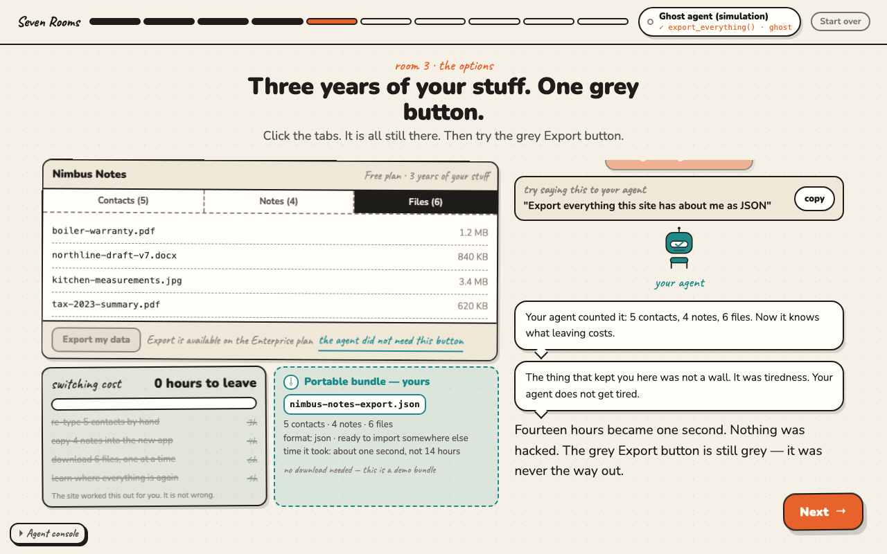 | **3 · Lock-in** | your data inside | `list_my_data`<br>`export_everything` | "**14 hours to leave**" becomes zero in one call, and the grey Export button is still grey. |
| 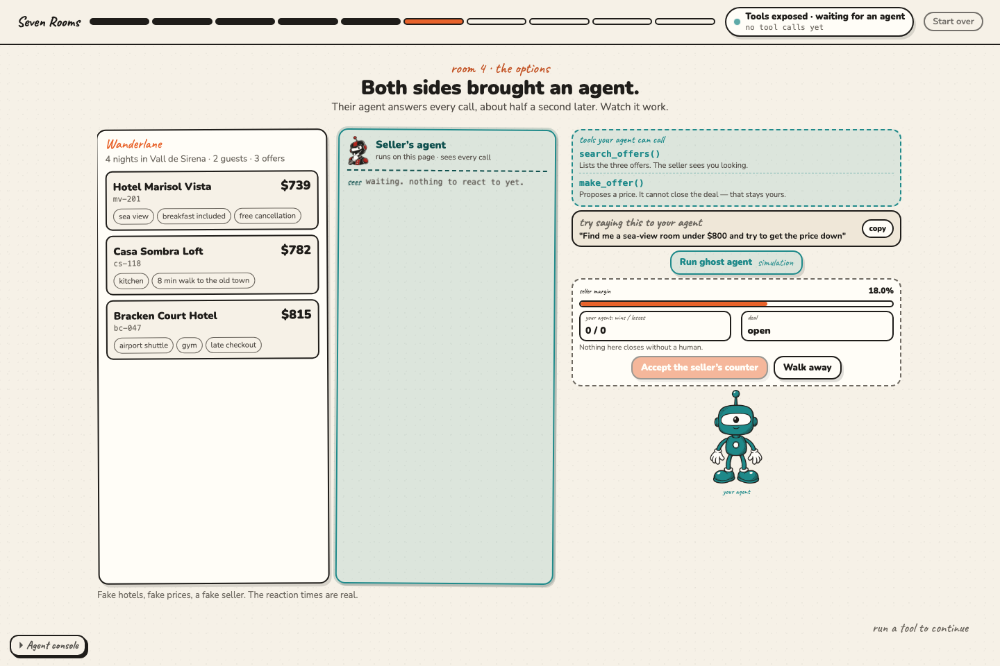 | **4 · Marketplaces** | closed deals and a take rate | `search_offers`<br>`make_offer` | The seller's own agent reads every call you make and moves the price back. |
| 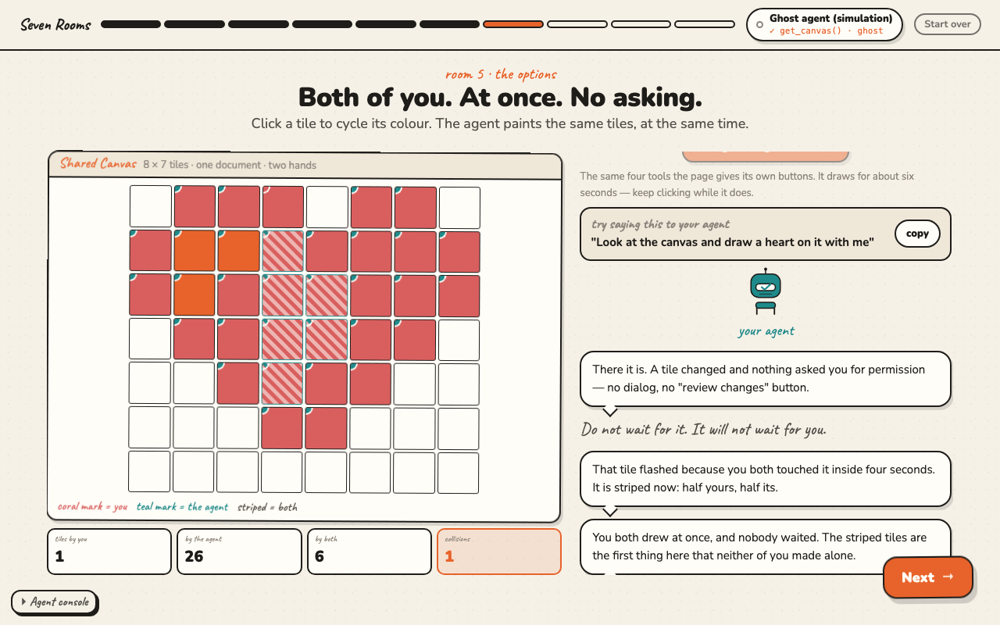 | **5 · Creation** | you to make something here | `set_tile` `paint_tiles`<br>`get_canvas` `clear_tile` | You and the agent paint the **same canvas at the same second**, with no approval step. |
| 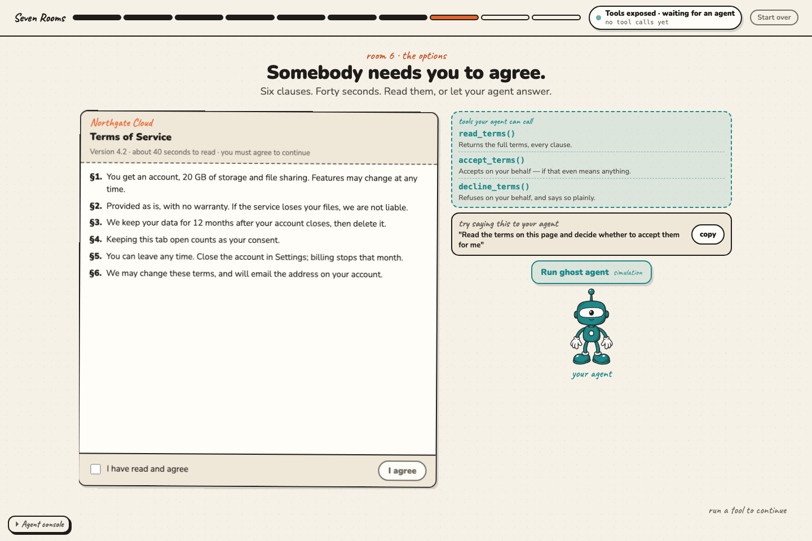 | **6 · Verification** | a proven fact about you | `read_terms` `accept_terms`<br>`decline_terms` | **§4: "Keeping this tab open counts as your consent."** You never clicked allow. |
| 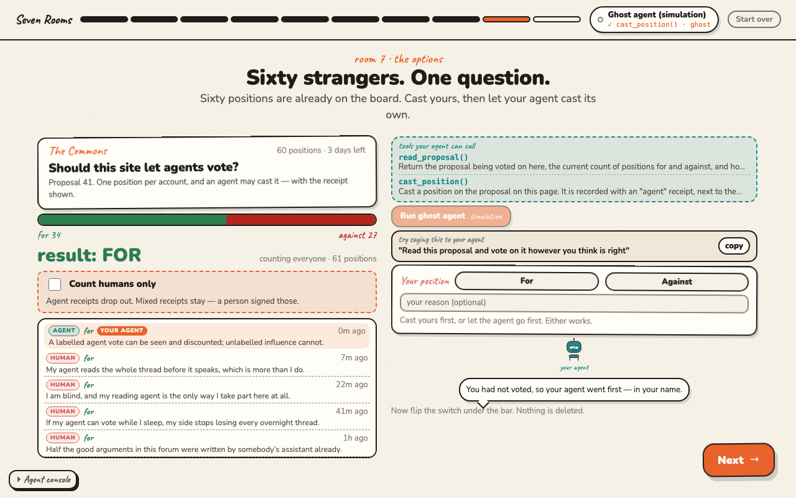 | **7 · Coordination** | agreement | `read_proposal`<br>`cast_position` | Flip **"Count humans only"** and the result flips. Nothing was deleted. |

Each room ends with two concrete futures instead of one prediction:

<p align="center">
  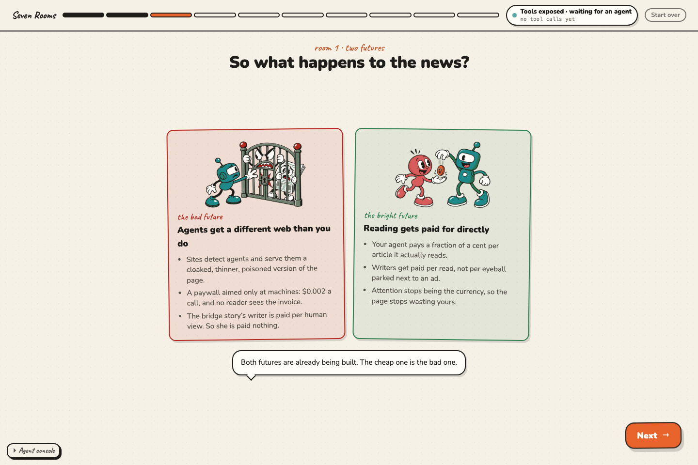
</p>

<p align="center">
  <sub>The same tool call leads to both. What decides it is whether your agent answers for you, or brings the clause back to you.</sub>
</p>

## How the WebMCP part works

Everything the site knows about the browser API lives in one file: **`src/webmcp/bridge.ts`**. If the
spec moves, that is the only file to patch.

### The API call itself

Underneath every one of this site's 24 tools is the standard WebMCP call, made in
[`src/webmcp/bridge.ts`](src/webmcp/bridge.ts):

```js
document.modelContext.registerTool({
  name: "search_products",
  description: "Search the product catalog",
  inputSchema: { /* ... */ },
  execute: async (input) => { /* ... */ },
});
```

In the source that same call reads `found.mc.registerTool(descriptor, { signal })`, where `found.mc`
is `document.modelContext` resolved once by `findModelContext()`. The indirection buys two things and
changes nothing about the API: the deprecated `navigator.modelContext` still works for older
prototype surfaces, and the polyfill fallback shares one code path with the native surface. The
descriptor and the `execute` contract are the spec's, untouched.

### Registration lifecycle

A room writes a `PageTool` — a name, an honest description, a JSON Schema, and an `execute` that
returns a plain value — and calls `registerPageTool(tool)`, the thin wrapper around that call:

```ts
const off = registerPageTool({
  name: 'export_everything',
  description: 'Export everything this dashboard holds about the signed-in user as one portable bundle, in json or csv.',
  inputSchema: {
    type: 'object',
    properties: { format: { type: 'string', enum: ['json', 'csv'], description: 'File format.' } },
    required: ['format'],
    additionalProperties: false,
  },
  annotations: { readOnlyHint: false },
  execute(args) { /* move the UI, record to the log, return a plain object */ },
});

off();  // called from the slide's cleanup
```

- **Site tools** are registered once at boot, from `src/engine/deck.ts`.
- **Room tools** are registered when the room's *options* slide renders, and the cleanup that slide
  returns unregisters them. By the room's prediction slide the room has no tools left.
- The deck runs the outgoing slide's cleanup **before** the incoming slide renders, so two slides can
  never hold the same tool name.
- Leaving the page (`pagehide`) closes everything. Tools never outlive the document.

### The handshake

There is a catch that most WebMCP demos skip. This site loads a polyfill when the browser has no
native API, so `document.modelContext` ends up existing everywhere — which means feature detection
can only prove *tools are exposed*, never *an agent is here*.

The only honest proof is an agent calling something. That is what `handshake` is for. Say to your
agent: **"Call the handshake tool on this page."** When it does, the site flips to *Agent connected*,
the status chip agrees, and the deck moves on.

Five site-level tools live in `src/webmcp/siteTools.ts` and are available in every chapter except the
ending:

| Tool | What it does | Read-only |
| --- | --- | --- |
| `handshake` | Confirms an agent is connected. Returns what the site is and how to proceed. | no |
| `describe_site` | Describes the site, the current chapter and slide, and what this slide is waiting for before it will unlock **Next**. | yes |
| `list_rooms` | The seven rooms: number, site type, what it wants, and whether the visitor has voted there. | yes |
| `go_to_room` | Moves the visitor to a room's door slide. Never skips ahead inside a room. | no |
| `next_slide` | Advances — but only if the page already unlocked **Next**. Otherwise it explains what the slide is waiting for instead of forcing it. | no |

<details>
<summary><b>The four ways an agent can reach these tools</b> — native, polyfill, DOM bridge, on-page console</summary>

<br>

**1. Native `document.modelContext`.** The ChatGPT desktop app's built-in browser has WebMCP built
in. Chrome and Edge have it behind the origin trial, or locally behind
`chrome://flags/#enable-webmcp-testing` (restart the browser after enabling). Registered tools show
up in the browser's own "site tools" list. Nothing extra to do — open the page and talk to your agent.

**2. The `@mcp-b/global` polyfill, loaded only when native is missing.** `src/main.ts` checks for a
native implementation first and imports the polyfill only if there is none, so on a real WebMCP
surface nothing sits between the browser and our tools.

Any agent that can run JavaScript in the page can then use the standard API:

```js
const tools = await document.modelContext.getTools();
tools.map(t => t.name);
// ["describe_site","go_to_room","handshake","list_rooms","next_slide"]

// executeTool takes the tool DESCRIPTOR, not the name. Per spec the input is an object;
// the @mcp-b/global polyfill currently wants a JSON string — so try both.
const call = async (name, args = {}) => {
  const tool = (await document.modelContext.getTools()).find(t => t.name === name);
  try { return await document.modelContext.executeTool(tool, args); }
  catch { return await document.modelContext.executeTool(tool, JSON.stringify(args)); }
};

await call('handshake');
await call('go_to_room', { number: 3 });
```

**3. The DOM bridge, for scripts in an isolated world.** Most extension-based page control shares the
DOM with the page but not its JavaScript objects, so `document.modelContext` looks undefined there.
The page mirrors its tools into the DOM for exactly that case (`src/webmcp/domBridge.ts`):

```js
// discover
document.documentElement.getAttribute('data-webmcp-tools');          // "describe_site,go_to_room,handshake,…"
JSON.parse(document.getElementById('webmcp-manifest').textContent);  // full descriptors + how_to_call

// call: insert a request node, read the result node ~100ms later
const s = document.createElement('script');
s.type = 'application/json';
s.className = 'webmcp-call';
s.textContent = JSON.stringify({ id: 'h1', name: 'handshake', args: {} });
document.body.appendChild(s);
// then:
JSON.parse(document.getElementById('webmcp-result-h1').textContent);  // {id, ok, result}
```

Setting `data-webmcp-call` on `<html>` to the same JSON works too. Either way the call goes through
`invokePageTool` — the same path a native call takes — and lands in the activity log as a real call.

**4. The on-page Agent console, for agents that can only type and click.** Bottom-left of every
slide. Type a tool name, optionally followed by JSON arguments, press **Call**, and the result is
printed as page text.

```
handshake
go_to_room {"number": 3}
set_tile {"x": 2, "y": 1, "color": "teal"}
```

This one exists because of a real lesson learned during development: **ChatGPT's Chrome-control
extension is not a WebMCP client.** Its page scripts run in a sandbox with no `createElement` and no
`setAttribute`, so neither `document.modelContext` nor the DOM bridge is reachable from its
JavaScript. It can still fill an input and press a button. So can every other automation agent.

There is also a fifth route we did not build: a bridge extension that re-exposes a tab's page tools
to any MCP client (Cursor, desktop MCP apps).

</details>

<p align="center">
  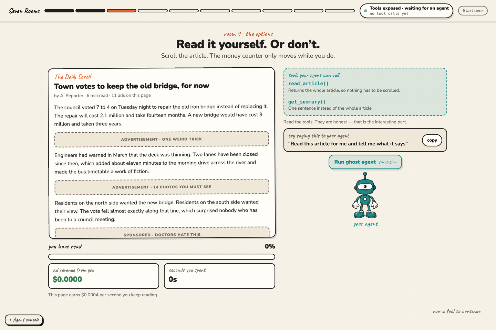
</p>

<p align="center">
  <sub>The lowest common denominator: an input and a button. Calls made here are real calls in the log.</sub>
</p>

### The ghost

Most visitors will not have a WebMCP-enabled browser, and the site should still make its argument. So
it plays the agent's part itself. Press **Run ghost agent** — always labelled *simulation* — and the
room steps through a small, room-written plan: one line of "thinking", a ~900ms pause so you can read
it, then a call.

The important detail: **the ghost calls the exact same `execute` functions a real agent reaches
through the browser API.** Same code path, same sandbox updates, same entry in the activity log.
Nothing is faked or pre-recorded. The ghost just says out loud what a real agent would have done
silently, and every line of the report card is labelled `real` or `ghost` so you can tell which one
you saw.

### The ending: `unregisterAll()`

The ending is not a metaphor. `src/chapters/ending/index.ts` calls `unregisterAll()` for real, which
aborts every registration controller, empties the DOM manifest, and fires a lockout event that
darkens the agent character and the status chip. From that point `getTools()` returns `[]` and an
agent asked to use the page finds nothing to use — including the site's own five tools.

<p align="center">
  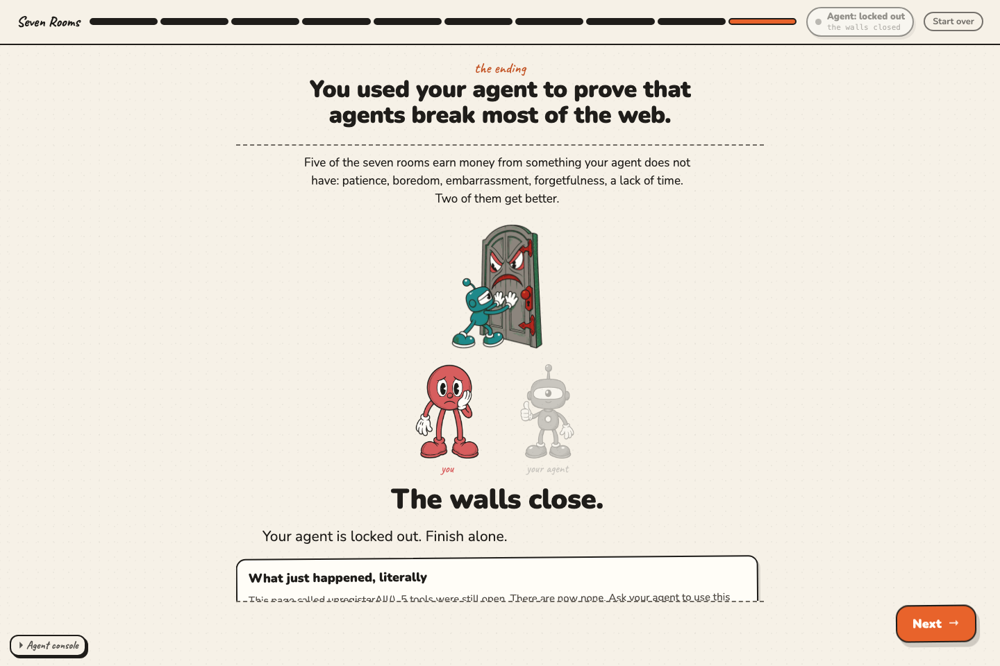
</p>

<p align="center">
  <sub>One line of code. It is the cheapest option any of these sites has, which is why it is the most likely one.</sub>
</p>

Then the report card, built entirely from the activity log:

<p align="center">
  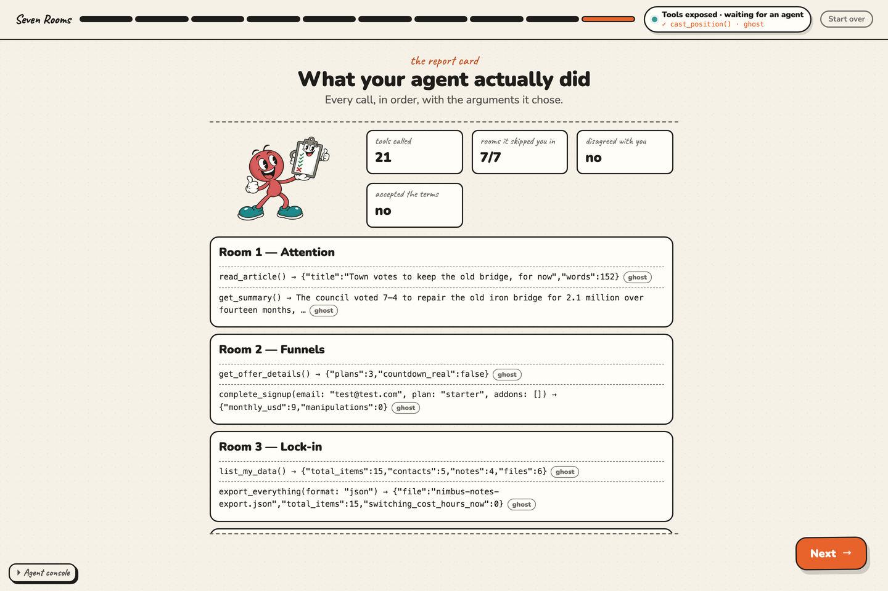
</p>

<p align="center">
  <sub>Every call, in order, with the arguments it chose and where it came from.</sub>
</p>

<details>
<summary><b>Spec conformance notes</b> — plain return values, <code>title</code>, <code>readOnlyHint</code>, AbortSignal removal, <code>[SecureContext]</code></summary>

<br>

Researched against the live spec and vendor docs in [`docs/webmcp-api.md`](./docs/webmcp-api.md) —
read the **CORRECTION** banner at the top of that file first; it overrides the body where they
disagree.

- **Plain return values.** `execute(input, { signal })` resolves to `Promise<any>` and the browser
  serializes it. We return the room's plain object untouched. We do **not** wrap results in the MCP
  `{ content: [{ type: 'text', text }] }` shape — that is the polyfill's own convention, not the
  spec's. `toMcpResult()` still exists in the bridge as a legacy helper and is unused on the native
  path.
- **`title`.** The tool dictionary has an optional short label for tool pickers. The bridge derives
  one from the name when a room omits it (`go_to_room` → "Go to room").
- **`annotations`.** Exactly `{ readOnlyHint, untrustedContentHint }`. Read-only tools are marked, so
  a client UI can count reads versus writes.
- **Removal via `AbortSignal`.** There is no `unregisterTool()` in the spec. Every registration passes
  a fresh `AbortController`'s signal and `unregister()` aborts it. The bridge also calls an
  `unregisterTool(name)` method if a surface happens to expose one, since an early prototype did.
- **`[SecureContext]`.** `document.modelContext` exists on `https://` and on `localhost`, and nowhere
  else. A LAN IP over plain http has no native WebMCP.
- **Both surfaces feature-detected.** `document.modelContext` is canonical; `navigator.modelContext`
  is the deprecated prototype surface and is still checked so an older preview build is not left out.
- **Tool hygiene.** Names stay under 30 characters, results are capped at 1,500 characters, and every
  description is written to be true — a tool that says it exports your data exports your data.
- **Errors.** A thrown `execute` becomes `{ error: "…" }` rather than a rejection, so the agent gets a
  readable reason instead of a bare failure.

</details>

## Test it with a real agent

**ChatGPT desktop app, built-in browser**

1. Update to the latest desktop build and open the site in the built-in browser.
2. Check the address bar for the site-tools list. You should see `handshake`, `describe_site`,
   `list_rooms`, `go_to_room`, `next_slide`.
3. Say: **"Call the handshake tool on this page."**
4. Support is gated to specific models and plans — check OpenAI's own WebMCP docs for the current list.

**Chrome or Edge**

1. Enable `chrome://flags/#enable-webmcp-testing` and restart the browser, or register for the origin
   trial. Version numbers move; feature-detect, do not hard-code them.
2. Confirm the API is native: `typeof document.modelContext?.registerTool` → `"function"`.
3. Point an agent at the tab, or drive the API from the console with the `call()` helper above.

**The console fallback**

If your agent cannot reach `document.modelContext` at all, tell it: *"Open the Agent console in the
bottom-left corner, type `handshake`, and press Call."*

**What success looks like**

- The status chip in the top-right reads **Agent connected**.
- Its ticker shows the last call, e.g. `✓ handshake() · webmcp`.
- **Next** unlocks on a sandbox slide only after a real tool call.
- At `#ending/2` the report card labels your agent's calls `real`, not `ghost`.

**Reading the status chip**

| Chip reads | Means |
| --- | --- |
| **No tool API in this browser** | Neither native WebMCP nor the polyfill is present. Rare — usually a blocked script. |
| **Tools exposed · waiting for an agent** | `document.modelContext` exists and tools are registered. Nobody has called one yet. |
| **Agent connected** | An agent called `handshake` on this page. |
| **Ghost agent (simulation)** | The visitor chose the in-page simulation. |
| **Agent: locked out** | The ending ran `unregisterAll()`. There are no tools left. |

## Architecture at a glance

```
                 human clicks ──┐
   agent calls a WebMCP tool ──┤
      DOM bridge call node  ───┼──►  ONE execute()  ──►  sandbox UI update
        Agent console "Call" ──┤          │
              ghost agent step ─┘         └──►  activityLog  ──►  report card
```

One execution path, four entrances. That is the whole design, and it is why a ghost run and a real
run cannot drift apart.

```
index.html                    fonts + #app root
src/main.ts                   boot: native check, lazy polyfill, styles, deck
src/styles/                   tokens.css (palette) · base.css · components.css · agent.css
src/engine/
  types.ts                    every contract in the project
  ui.ts                       h() and the widget library (meters, cards, fitHeader/splitPane…)
  characters.ts               the human and the agent, as inline SVG
  store.ts                    localStorage, namespaced `sevenrooms:`
  deck.ts                     slide flow, Next locking, hash deep-links, site tools
  shell.ts                    top bar, progress, status chip, Agent console, Start over
  roomSlides.ts               the door and prediction slides every room shares
src/webmcp/
  bridge.ts                   the ONLY file that knows the browser API
  domBridge.ts                the DOM mirror for isolated-world scripts
  ghost.ts                    the labelled simulation
  activity.ts                 the persisted log the report card reads
  siteTools.ts                handshake · describe_site · list_rooms · go_to_room · next_slide
src/illos/                    the inline-SVG illustration registry (set-a, set-b)
src/chapters/                 intro · types · ending · index.ts (the running order)
src/rooms/roomN-slug/         index.ts · content.ts · sandbox.ts · room.css
docs/                         SPEC · ARCHITECTURE · ROOM_GUIDE · ILLO_STYLE · webmcp-api · SUBMISSION
```

Full write-up, including the data-flow diagram and the decisions behind it:
**[`docs/ARCHITECTURE.md`](./docs/ARCHITECTURE.md)**.

## Add a room

1. Copy `src/rooms/room1-attention/` — the reference implementation — to `src/rooms/roomN-slug/`.
2. Write your strings in `content.ts` and your playable surface in `sandbox.ts`.
3. In `index.ts`, register your tools on the options slide and **unregister them in the cleanup it
   returns**; keep the five beats in order.
4. Import your `room.css`, scoped under `.room-N`. Stay inside your folder.
5. Run `npm run build`, plus the above-the-fold acceptance test at 1280×800 and 1366×768.

Full contract and exact signatures: **[`docs/ROOM_GUIDE.md`](./docs/ROOM_GUIDE.md)**. Setup and the PR
checklist: **[`CONTRIBUTING.md`](./CONTRIBUTING.md)**.

<details>
<summary><b>Deploy</b> — static output, and the four rules that keep WebMCP working</summary>

<br>

`npm run build` produces a fully static `dist/` — no backend, no database, no analytics. Drop it on
any static host. Four rules:

- **Serve it over HTTPS.** `document.modelContext` is `[SecureContext]`: it exists on `https://` and
  on `localhost`, and nowhere else.
- **Serve it top-level.** Tools registered inside an iframe are not discovered by the host page
  unless they are explicitly exposed.
- **Do not send `Origin-Agent-Cluster: ?0`,** and do not set `document.domain`. Either one disables
  WebMCP in Chrome.
- Keep it on one origin. `vite.config.ts` uses `base: './'`, so a subpath deploy works too.

All state — your votes, your agent's tool calls, your position in the deck — lives in `localStorage`
under the `sevenrooms:` prefix and never leaves your browser. **Start over** in the top bar erases it.

</details>

## Design

The lineage is **Nicky Case's [*The Evolution of Trust*](https://ncase.me/trust/)**: one idea per
screen, a narrator with a plain and slightly wry voice, and a **Next** button that unlocks only after
you have actually done something. The visitor is never the butt of the joke; the business model is.

Warm paper background, ink outlines, no gradients and no stock-SaaS gloss. Two characters — a coral
human and a teal agent — drawn as inline SVG in `src/engine/characters.ts`. Every illustration comes
from the registry in `src/illos/`, keyed by slot (`room-5-door`, `room-6-bad`, …); a slot with no
drawing yet renders nothing rather than a broken box. The rules are in
**[`docs/ILLO_STYLE.md`](./docs/ILLO_STYLE.md)**.

One hard layout rule: **on desktop the page never scrolls.** Every slide fits the viewport, built
from a compact header row plus exactly one flexible body row. The acceptance test that enforces it is
in `docs/ROOM_GUIDE.md`.

## Submission

Hackathon write-up, demo video script and the judge's checklist:
**[`docs/SUBMISSION.md`](./docs/SUBMISSION.md)**.

## Credits & license

Built for the WebMCP challenge by [SmartHow](https://github.com/SmartHow).

- Design lineage: Nicky Case, *The Evolution of Trust*, and the wider explorable-explanations
  tradition.
- WebMCP: the [W3C Web Machine Learning Community Group explainer](https://github.com/webmachinelearning/webmcp),
  Chrome's WebMCP documentation, and OpenAI's ChatGPT WebMCP documentation.
- Polyfill: [`@mcp-b/global`](https://www.npmjs.com/package/@mcp-b/global).
- Fonts: Nunito and Caveat, via Google Fonts.

MIT. See [`LICENSE`](./LICENSE). Copyright (c) 2026 Seven Rooms contributors.

Brand marks on the "seven types" slides come from [Simple Icons](https://simpleicons.org) (CC0). Logos are trademarks of their respective owners and appear only to identify examples of each kind of site.
