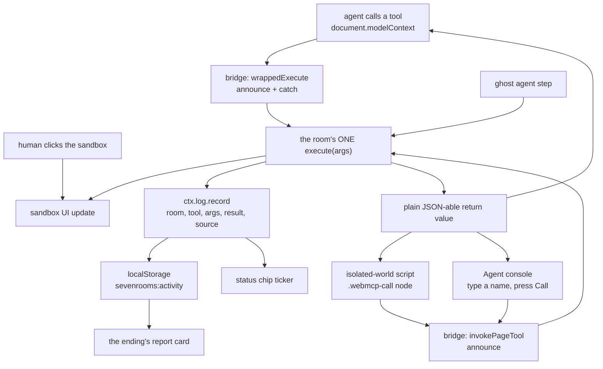

# Architecture

How Seven Rooms is built, and why it is built that way.

Read [`SPEC.md`](./SPEC.md) for what the site is meant to be, [`ROOM_GUIDE.md`](./ROOM_GUIDE.md)
for how to write a room, and [`webmcp-api.md`](./webmcp-api.md) for the researched state of the
browser API (mind the **CORRECTION** banner at the top of that file — it overrides the body).

Everything is Vite + vanilla TypeScript. No framework, no runtime dependency except the WebMCP
polyfill, and that one is lazy.

---

## 1. The slide deck

### Contracts

Every contract in the project lives in `src/engine/types.ts`. Nothing depends on the rooms.

```ts
interface Slide {
  id: string;
  /** Render into `el`. Return an optional cleanup fn. */
  render(el: HTMLElement, ctx: SlideContext): void | (() => void);
}

interface Chapter { id: string; title: string; slides: Slide[] }

interface Room extends Chapter {
  number: 1|2|3|4|5|6|7;
  siteType: string;      // "Attention"
  wants: string;         // "human seconds on the page"
  prediction: string;    // "Block agents, or charge them per call."
  lead?: string;         // the room's long explanation, rendered on the door slide
}
```

`src/chapters/index.ts` is the running order and it is pre-wired:
`[intro, types, room1…room7, ending]` — ten chapters, which is exactly the ten segments of the
progress bar. A room author never edits it.

### `SlideContext`

`src/engine/deck.ts` builds one context object per slide render:

| Member | Purpose |
| --- | --- |
| `done()` | Unlocks the **Next** button. Safe to call twice. A door slide calls it immediately; a sandbox slide calls it after the first tool call. |
| `hint(text)` | The short note shown next to a locked **Next**, e.g. `"run a tool to continue"`. `''` clears it. `next_slide()` reads this text so an agent gets told what the page is waiting for. |
| `log` | The shared `ActivityLog`. Every `execute` records here. |
| `agent` | The live agent surface. **A getter, not a snapshot** — a slide still on screen when the visitor picks the ghost, or when an agent calls `handshake`, sees the new state without re-rendering. |
| `store` | The namespaced `localStorage` helper. |
| `goNext()` | Programmatic advance. Rare. |

### The render cycle

`render(i)` in `deck.ts`, in order:

1. Run the previous slide's cleanup — **before** anything new registers, so two slides can never
   hold the same tool name.
2. Lock **Next**, clear the stage.
3. Set the stage class to `slide room-N` while inside a room, so room CSS can scope itself
   (`.room-5 .canvas { … }`) and cannot leak.
4. Move the progress bar; un-darken the status chip unless we are in the ending.
5. Re-register the site tools if they are missing (walking back out of the ending must bring the
   page back to life for an agent — otherwise it is dead until a reload).
6. Write the hash, scroll to top, persist the position.
7. Call `slide.render(stage, ctx)` inside a `try`. A slide that throws prints a plain apology and
   unlocks **Next**, so one broken room cannot trap the visitor.

Forward and back are `ArrowRight` / `ArrowLeft` as well as the button. Keys are never stolen from
an `<input>`, `<textarea>`, `<select>` or a contenteditable.

### Hash deep-links

`#<chapterId>/<slideIndexInChapter>` — `#room-5/1` is room 5's options slide, `#ending/2` is the
report card. The deck writes the hash with `history.replaceState` (guarded by a one-tick lock so
its own write does not bounce back through `hashchange`) and reads it on boot. This is what makes
room development and the acceptance test possible.

### Position persistence and Start over

- `store.set('position', { chapter, slide })` on every render. This is a breadcrumb for debugging
  and analytics-free "where was I", not an auto-resume: boot honours the **hash**, not the stored
  position, so a fresh visit to the bare URL always starts at the title screen. That is deliberate
  — a judge or a first-time reader should never land in the middle of someone else's run.
- **Start over** (top bar) is the escape hatch: it confirms, then clears the activity log, clears
  the whole `sevenrooms:` namespace, empties the hash and reloads. One click to a clean slate.

---

## 2. The shell

`src/engine/shell.ts` owns the page chrome and no story logic.

- **Progress bar** — one `<li>` per chapter, with the chapter title as its `title`/`aria-label`.
  Earlier segments get `--done`, the current one `--current`.
- **Agent status chip** (top-right) — four honest states plus a dark lockout state, and a live
  ticker. The ticker has two sources: `onToolCall` announces a call as it *starts* (`→ name()`) and
  the activity log confirms it as it *finishes* (`✓ name() · webmcp`). Leaving the ending restores
  both the label and the last tick, so "the walls closed" never lingers over a live room.
- **Agent console** (bottom-left, a `<details>`) — the type-and-click channel. It lists the tools
  registered right now, parses `name` plus optional trailing JSON, calls `invokePageTool`, and
  prints the result as page text capped at 1,500 characters.
- **Fixed Next button** (bottom-right) plus the wait note above it. Hidden until `ctx.done()`.
  Because it is fixed, the side column of every options slide carries 40px of bottom padding so a
  narrator bubble is never covered.
- **`LOCKOUT_EVENT`** — `'sevenrooms:lockout'`, dispatched on `window` by the ending. The shell
  listens and darkens the chip. This keeps the ending from having to reach into the shell.

---

## 3. The WebMCP layer

Four files in `src/webmcp/`, one of which is allowed to know what the browser API looks like.

### `bridge.ts` — the registry

`findModelContext()` prefers `document.modelContext` and falls back to the deprecated
`navigator.modelContext`, returning a small structural type. Everything else in the project talks
to `registerPageTool` / `invokePageTool` and never touches the browser object.

`registerPageTool(tool)`:

1. Makes a fresh `AbortController` — the spec's only removal mechanism.
2. Wraps the room's `execute` so that every call is `announce`d to the chip's ticker, and a thrown
   error comes back as `{ error: "Tool \"x\" failed: …" }` instead of a rejection.
3. Registers on the surface if one exists, with `title` (derived from the name when absent),
   `description`, `inputSchema`, `annotations` and `{ signal }`. A rejected `registerTool` promise
   is logged rather than swallowed.
4. Adds the tool to an internal `live` map and re-syncs the DOM manifest.
5. Returns `unregister()`, which is idempotent: it drops the map entry, re-syncs the manifest,
   aborts the controller, and calls `unregisterTool(name)` if the surface happens to have one.

**A tool works even with no surface at all.** It is still in the `live` map, so the ghost, the DOM
bridge and the Agent console can all run it and the UI is identical. That is what makes the site
work in every browser without a second code path.

`unregisterAll()` closes everything and empties the manifest. The ending calls it. A room never does.

### Native vs polyfill

`src/main.ts`:

```ts
const nativeWebMcp = typeof document.modelContext?.registerTool === 'function';
if (!nativeWebMcp) {
  await import('@mcp-b/global');
}
```

Native first, deliberately: on a real WebMCP surface nothing should sit between the browser and our
tools. Elsewhere the polyfill gives page-driving agents a spec-shaped object to call. The
consequence is the whole reason `handshake` exists — after boot `document.modelContext` is present
in every browser, so feature detection can only mean *tools are exposed*, never *an agent is here*.

### `domBridge.ts` — the DOM mirror

Extension-based agents usually run in an **isolated world**: same DOM, different JavaScript realm,
so page-set `document.modelContext` is undefined to them. The DOM crosses worlds, so the bridge
publishes the surface as markup.

**Discovery**

- `<script type="application/json" id="webmcp-manifest">` — protocol name, version, site name,
  every registered tool's `{ name, description, inputSchema }`, and a `how_to_call` string that
  explains the whole protocol to an agent that only found the manifest.
- `data-webmcp-tools="a,b,c"` and `data-webmcp-bridge="dom"` on `<html>`, for one-line discovery.

Both are rewritten by `syncDomManifest()` on every register and unregister.

**Calling**

A `MutationObserver` on `<html>` (childList + subtree, plus the `data-webmcp-call` attribute)
watches for either:

- a `<script type="application/json" class="webmcp-call">` node containing
  `{"id","name","args"}` anywhere in `<body>`, or
- `data-webmcp-call` on `<html>` set to that same JSON.

The node is marked taken and removed (so it cannot fire twice), the call goes through
`invokePageTool`, and the answer is written as
`<script type="application/json" id="webmcp-result-<id>">{"id","ok","result"}</script>` plus a
mirrored `data-webmcp-result-<id>` attribute on `<html>` (truncated to 4,000 chars). Ids are
sanitised to `[A-Za-z0-9_-]` and capped at 64 characters.

### `ghost.ts` — the labelled simulation

`runGhostAgent({ tools, plan, onThought, delayMs = 900, onResult })`. For each step it prints one
line of thinking, waits, then calls `tool.execute(step.args)` — the same function object a real
agent reaches. The delay is not decoration: the point of a room is that the human *sees* the agent
do in a second what the site wanted two minutes for.

Room 5 builds its plan at click time rather than up front: it calls `get_canvas` first, then aims
some strokes at tiles the human has already painted, the way a real agent would after reading the
canvas.

### `activity.ts` — the log

The persisted record the ending's report card is built from. `sevenrooms:activity`, capped at 300
entries with results shrunk to 600 characters, because a chatty tool must not blow the
`localStorage` quota. `normaliseSource` collapses the four `AgentMode` values into `webmcp` or
`ghost` in exactly one place, so the report card only ever has two badges to draw.

### `siteTools.ts` — surface modes and the handshake

Five tools registered once from `deck.ts` (the only place that holds both the deck and the shell):
`handshake`, `describe_site`, `list_rooms`, `go_to_room`, `next_slide`. They talk to the deck
through a `SiteToolsHost` interface — `where()`, `canAdvance()`, `waitingFor()`, `next()`,
`goToChapter()` — so the tools do not import the deck and the deck does not import the tools'
internals.

Every result runs through a 1,500-character cap and is recorded with `room: 0`.

**Surface modes.** `AgentMode` is `'none' | 'api' | 'agent' | 'ghost'`.

- `none` / `api` come from *detection*: is there a `document.modelContext` at all?
- `agent` / `ghost` are *choices*, and they are remembered in `sevenrooms:surface`. A remembered
  `agent` is discarded if the API has vanished (same `localStorage`, different browser).
- `handshake` is what flips the mode to `agent` — `setSurfaceMode('agent')` — and the change is
  broadcast through `onSurfaceChange`, which the status chip and every live `ctx.agent` getter read.

`next_slide` is the polite one: if **Next** is still locked it returns the slide's own wait note
instead of forcing an advance. An agent is told what to do, not stopped with an error.

---

## 4. The above-the-fold layout system

**The rule: on desktop (≥ 768px) the page must never scroll.** Every slide fits the viewport. Below
768px the columns stack and scrolling is allowed.

A slide is exactly two rows at the top level, and nothing else:

```
fitHeader({ eyebrow, title, lead? })     // flex: 0 0 auto
+ ONE body row                           // flex: 1 1 auto; min-height: 0
    fitBody(...)      centers its content vertically
    fitScroll(...)    same, but scrolls internally (the report card only)
    splitPane({ main, side, ratio })     two columns, 58/42 by default
```

`fitHeader`'s `lead` is a one-line label, not an explanation: anything over `FIT_LEAD_MAX` (110
characters) is truncated with a console warning. That warning is the signal to move the text to the
room's `lead` field, which `doorSlide()` renders on beat 1. This is why the options slide of every
room has room for a sandbox at all.

`compactToolCards()` exists for the same reason — the tool list as a tight monospace-name-plus-one-line
column, where the big boxy `toolCard()` would not fit.

### The acceptance test

Run per slide, at 1280×800 and at 1366×768:

```js
// 1. the PAGE must not scroll
({ ok: document.documentElement.scrollHeight <= window.innerHeight + 1 })

// 2. and the content must genuinely FIT — not be clipped, not be internally scrolled
(() => {
  const s = document.querySelector('.slide');
  const internal = [...document.querySelectorAll('.slide,.fitbody,.split__side')]
    .filter(e => e.scrollHeight - e.clientHeight > 1)
    .map(e => e.className);
  return { slideOver: s.scrollHeight - s.clientHeight, internal };
})()
```

Pass means `ok: true`, `slideOver: 0`, and an empty `internal` list. A pane showing up in
`internal` is a signal to cut words, not to add a scrollbar. Also check 375×812 for horizontal
overflow. The full script is in [`ROOM_GUIDE.md`](./ROOM_GUIDE.md).

---

## 5. The illustration registry

`src/illos/index.ts` merges two files, `set-a.ts` and `set-b.ts`, into one
`Record<slotKey, svgMarkup>` so two authors can work in parallel without touching the same file.
`getIllo(name)` returns the markup or `undefined`; `hasIllo(name)` is the guard.

Slots are keyed by position, not by filename: `intro-choice-agent`, `ending-walls`,
`ending-report`, and per room `room-N-door` / `room-N-bad` / `room-N-bright`, plus `type-1…type-7`.
`illo(name)` in `ui.ts` returns an **empty, hidden element** for an unfilled slot — never a broken
box and never a gap — which is what let the rooms, the chapters and the illustrations be built at
the same time. Style rules (2.5px ink outlines, flat palette fills, `viewBox="0 0 320 200"`, no
text inside the SVG) are in [`ILLO_STYLE.md`](./ILLO_STYLE.md).

---

## 6. Data flow

Four entrances, one execution path.



Two things follow from this diagram, and they are the two things that make the site honest:

- A human clicking the sandbox and an agent calling a tool reach the **same** state, because the
  sandbox is the state and `execute` is the only writer.
- The ghost is not a mock. It enters at `execute`, exactly where a real agent's call lands after
  the bridge has announced it. So a ghost run and a real run produce the same UI changes and the
  same log entries — only the `source` field differs, and the UI always shows it.

---

## 7. Decisions and trade-offs

**No framework.** The site is 51 slides (3 intro + 9 types + 7 rooms × 5 + 4 ending) of mostly static content with a handful of stateful
sandboxes. A framework would have added a build story, a hydration story and a bundle for a problem
that `h()` — a 20-line DOM builder — solves. The cost is real: no diffing, so every stateful widget
returns a small handle (`{ el, set(v) }`) and each room re-implements its own tiny render loop. We
took that cost on purpose, because the interesting part of this project is the WebMCP layer and it
should be readable without knowing anyone's component model.

**`localStorage` only, no backend.** Room 7's sixty positions are seeded local data and the vote
tallies start from an invented baseline, and both say so on screen. A real backend would have made
room 7's "previous visitors" true, and it would also have made the site un-auditable: a judge
cannot check what our server does with their agent's calls. Static and local means the claim "your
agent's calls never leave your browser" is verifiable by reading `dist/`. The trade-off is that
nothing is shared between visitors.

**The polyfill is lazy.** `@mcp-b/global` is 306 KB — nearly twice the rest of the site. Loading it
unconditionally would (a) put a wrapper between a native browser implementation and our tools, and
(b) charge every visitor for a fallback most of them do not need. So `main.ts` feature-detects
first and `await import()`s only when there is no native surface. Cost: a top-level `await` in the
entry module, so the build targets `es2022`.

**Plain return values.** The MCP `{ content: [{ type: 'text', text }] }` shape is the MCP-B
polyfill's convention. The live spec says `execute` resolves to `Promise<any>` and the browser
serializes it, and ChatGPT's own reference example returns a bare object. So rooms return plain
values and the bridge passes them through untouched. `toMcpResult()` is kept as a legacy helper and
is unused on the native path — one function to delete, rather than a wrapping layer to unwind, if
the spec moves again.

**The ghost is labelled, always.** It would be easy — and much more impressive-looking — to run the
simulation silently and let visitors believe an agent did it. That would break the one claim the
site is making. So the button says *simulation*, the status chip says *Ghost agent (simulation)*,
and every line of the report card carries a `real` or `ghost` badge. The site is an argument about
honesty between pages and agents; it does not get to lie to the reader.

**The Agent console exists because of a real failure.** ChatGPT's Chrome-control extension is not a
WebMCP client. Its page scripts run in a sandbox without `createElement` or `setAttribute`, so
neither `document.modelContext` nor the DOM bridge is reachable from its JavaScript — a visitor's
agent reported exactly `document.modelContext is undefined`. But every automation agent can fill an
input and press a button. So the console is the lowest-common-denominator transport, and because it
goes through `invokePageTool`, calls made that way are real calls in the log.

**Four surface states instead of a boolean.** "Is an agent here?" has no answer from inside a page.
Collapsing it to yes/no would have meant either lying (`api` shown as connected) or hiding the
tools from agents that are present but quiet. Four states — `none`, `api`, `agent`, `ghost` — let
the chip say the true thing, and made `handshake` necessary, which turned out to be the clearest
part of the whole demo.

**Bundle size.** `npm run build` output:

| Asset | Raw | gzip |
| --- | --- | --- |
| `index.js` (the whole site) | ~170 KB | ~57 KB |
| `index.css` | ~70 KB | ~12 KB |
| lazy `@mcp-b/global` chunk | ~306 KB | ~82 KB |
| `index.html` | ~1 KB | ~0.6 KB |

The polyfill chunk is only fetched by browsers with no native WebMCP. A browser that has the API —
which is every browser we actually want to demo in — downloads about 240 KB raw, 70 KB over the wire.
